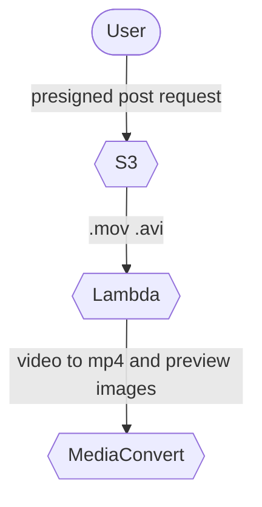

# Zdielaj.si

The application helps users quickly and easily share photos and videos without reducing quality.

## Required AWS services

* S3
* CloudFront
* Cognito
* Lambda
* DynamoDB
* API Gateway
* Media Convert

## Run frontend app

```shell
cd application/

npm install

npm run dev
```

## User flows

### Basic communication


### Upload fllow



### View flow


## License

[MIT license](./LICENSE)
