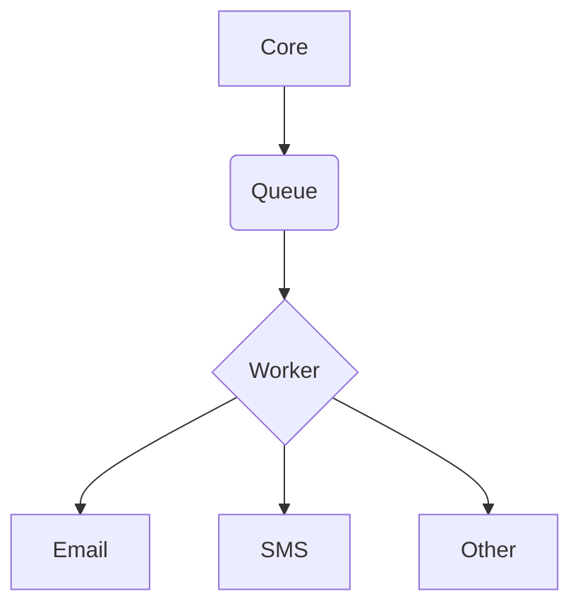

# Notifications

## Requirements

* AWS Queue
* AWS Email service

## Suggested architecture

```
********               ~~~~~~~~~
* Core * ------------> ~ Queue ~
********               ~~~~~~~~~
                           |
           **********      |
           * Worker * <-----
           **********
                |
                V
    _________________________
    |           |           |
    V           V           V
*********    *******    *********
* Email *    * SMS *    * Other *
*********    *******    *********
```



## Notify

URL:
```
/notifications/notify
```

Type:
```
POST
```

Data:
```json
{
  "event": {
    "name": ""
  },
  "parameters": {

  }
}
```

## E-mail

URL:
```
/notifications/email
```

Parameters:
```
u=<unique hash>
```

Returns:
```json
{
  "data": {
    "notifications": {
      "mail": [
        {
          "name": "Account notifications",
          "description": "Account changes and updates.",
          "enabled": true
        }
      ]
    }
  }
}
```