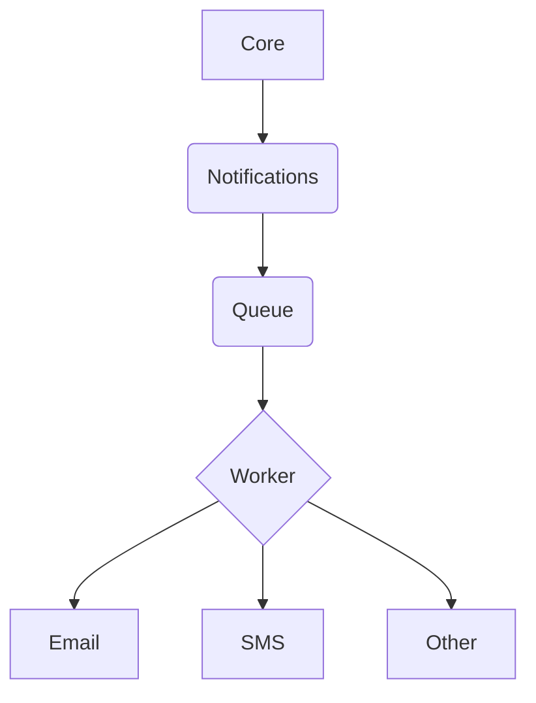

# Notifications

## Requirements

* AWS Queue
* AWS Email service

## Suggested architecture



## Notify

URL:
```
/notifications
```

Type:
```
POST
```

Data:
```json
{
  "name": "register",
  "parameters": {
    "email": "name.surname@domain",
    "firstName": "Name",
    "lastName": "Surname"
  }
}
```

## E-mail

URL:
```
/notifications/email
```

Parameters:
```
u=<unique hash>
```

Returns:
```json
{
  "data": {
    "notifications": {
      "mail": [
        {
          "name": "Account notifications",
          "description": "Account changes and updates.",
          "enabled": true
        }
      ]
    }
  }
}
```

## Templates

New templates can be created in [./templates](templates) folder based on the type, e. g. email template are in [./templates/email](templates/email) folder. Every template needs to have two methods: `isValid` and `render`.

## License

[MIT license](../LICENSE)
