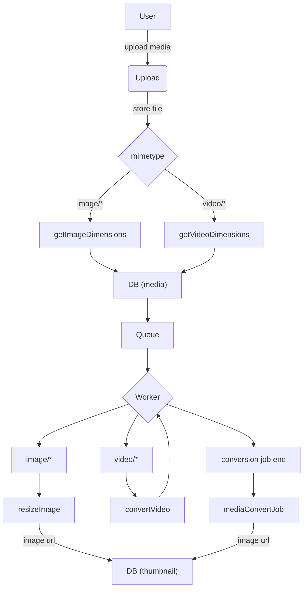

# Upload

Asynchronous upload service to store media - images and videos. It returns `id` of new media immediately and resizing and generating video previews are done in an async way.

## Requirements

* AWS S3
* AWS MediaConvert
* AWS EventBridge
* AWS Queue

## Process overview

## License

[MIT license](../LICENSE)
