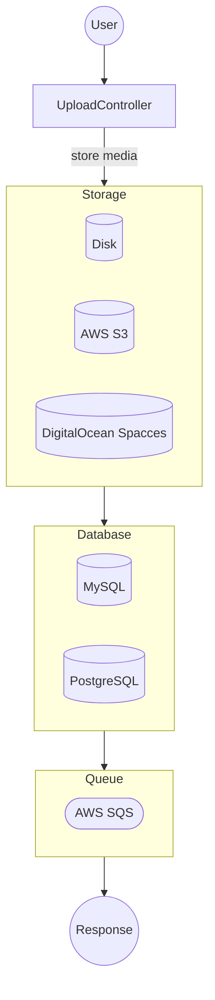
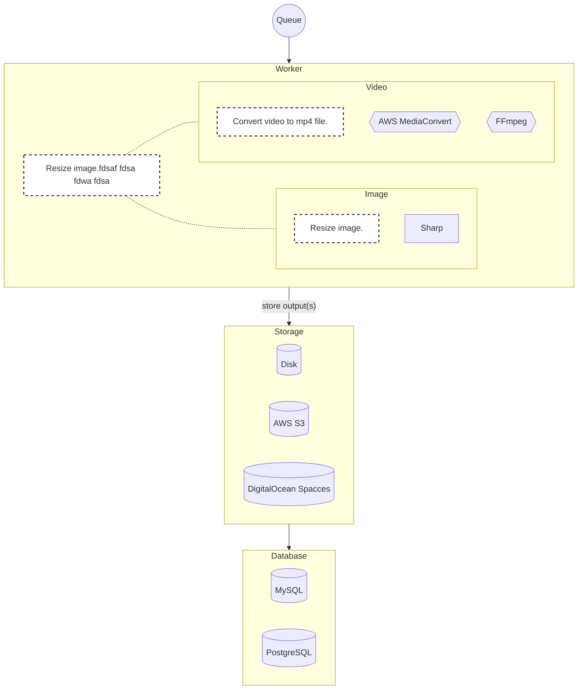

# Upload

Asynchronous upload service to store media - images and videos. It returns `id` of new media immediately and resizing and generating video previews are done in an async way.

## Requirements

There are three main options what can be used as a storage:
* AWS S3
* DigitalOcean Spaces
* Disk

After a file is uploaded, there is a post-processing generating *thumbnails* or converting video to *mp4*. This process is async and it requires a queue and optionally other services as well. Find more information in [docs](./docs) and read how to setup ([AWS](./docs/AWS.md) or [DigitalOcean](./docs/DO.md)).

## Process overview

### Main

### Post-processing

## License

[MIT license](../LICENSE)
