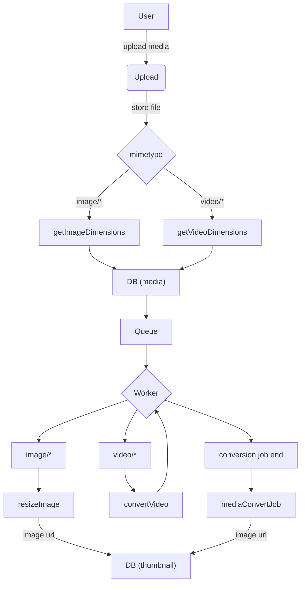

# Upload

Asynchronous upload service to store media - images and videos. It returns `id` of new media immediately and resizing and generating video previews are done in an async way.

## Requirements

* AWS S3
* AWS CloudFront
* AWS Queue
* AWS MediaConvert
* AWS EventBridge
* AWS Route53 (optional)

## Process overview



## AWS Setup

### S3

Storage for uploaded media. No special settings.

### CloudFront

AWS recommends to load objects from S3 through CloudFront. No special settings.

### Queue


### MediaConvert

All videos has to be converted to MP4 file, so browser can play them.

Upload first video to the bucket manually. Then go to AWS MediaConvert service and create first job.

1. Inputs **Input 1**
    * Input file URL is path to the first uploaded video
1. Add new **File** output group to create MP4 file
    * Destination can be the same bucket and the same path without specifying filename
    * Container is set to `MPEG-4 container`
    * Max bitrate is set to `5000000`
1. Add new **File** output group to create previews
    * Destination can be the same bucket and path can be set to subfolder `thumbnails`
    * Container is set to `No container`
    * Video codec is set to `Frame Capture to JPEG`
    * Quality is set to `100`
    * Frame rate is set to `30/300`
    * Max captures is set to `10`
1. Add new **File** output group to create preview thumbnails
    * Destination can be the same bucket and path can be set to subfolder `thumbnails`
    * Name modifier is set to `_thumbnail`
    * Container is set to `No container`
    * Video codec is set to `Frame Capture to JPEG`
    * Resolution is set to `320 x 180`
    * Quality is set to `100`
    * Frame rate is set to `30/300`
    * Max captures is set to `10`

*Job JSON should be roughly the same as in `worker/convertVideo.ts`.*

### EventBridge

When video is converted, system needs to be notified about this. This is done through EventBridge, which has the information that video is converted and can forward this information.

Go to **Rules** and create new rule. Fill name and then in *Event pattern* choose `AWS Services`, `MediaConvert`, `MediaConvert Job State Change` and pick `COMPLETE` and `ERROR` states. Upload service is then waiting to be notified through the same queue which is used to start this process. So set the target to `SQS queue` and choose queue.

```json
{
  "source": ["aws.mediaconvert"],
  "detail-type": ["MediaConvert Job State Change"],
  "detail": {
    "status": ["COMPLETE", "ERROR"]
  }
}
```

## License

[MIT license](../LICENSE)
